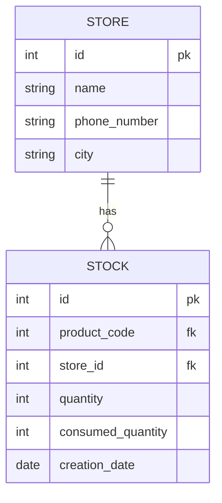

# Store Service

**Store Service** is a spring boot application designed for straightforward store inventory management. It comprises three main classes: `Store`, `Stock`, and `ProductsConsumptions`. It is built using Java Spring Boot and MySQL database. Lombok minimizes code, Maven simplifies project management, and API documentation is facilitated via Swagger.
- Note: Its part of a graduation project of Fawry internship.
- All microservices that make the entire ecommerce are here: [fawry final project](https://github.com/Fawry-Project)

# Features
- **Store Operations:** Utilize the `store` class to effortless CRUD (Create, Read, Update, Delete) operations to manage store details.
- **Stock tracking:** The `Stock` class ensures efficient inventory control by managing product quantities within the store.
- **Products Consumptions:** Track stock quantity changes over time with the `ProductsConsumptions` class, maintaining a reliable change history. got it by calling `product service`. 
- Validate products for 'order service' to check if the product quantity is valid

# Requirements
- Java 17 or higher
- MySQL Database

# Test the API here:
- [Swagger UI](http://localhost:8080/swagger-ui/index.html)

<a href="https://god.gw.postman.com/run-collection/31712037-c8af7245-e920-4769-9edb-349bd5b4118d?action=collection%2Ffork&source=rip_markdown">
  
  </a>

# ERD


# Setup
1. Clone the repository:
   ```
    git clone https://github.com/salmaahmed0/store-api.git
    cd store-api
   ```
2. Configure the database:
   -- Create a MySQL database and update the `application.properties` file under `src/main/resources` with your database configuration:
  ```
    spring.datasource.url=jdbc:postgresql://localhost:3306/your_database
    spring.datasource.username=your_username
    spring.datasource.password=your_password
  ```
3. Build and run the application:
  ```
    mvn spring-boot:run
  ```
After run the project you can test it from links in `Test the API` above.

# Project Structure
  - `controller/` - Contains API endpoints and request mappings.
  - `model/` - Contains the data models (e.g., `Store`, `Stock`, `ProductConsumption`, `ValidateProduct`).
  - `repository/` - Spring Data JPA repositories.
  - `service/` - Service layer for business logic.
  - `FawryApplication.java` - Main Spring Boot application class.
